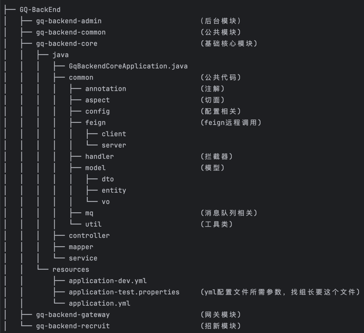

# 莞青小程序后端

<div style="text-align: center;">
    
</div>


## 项目详情

### 项目介绍

```text
GQ-Backend是莞工青年论坛小程序(莞青君)和后台系统,由于之前的系统挂在其
他部门的服务器下，很不方便，且系统比较古老，所以我们开发了一个全新系统。
该系统主要方便讲座派票和签到，以及每年的招新。欢迎各位小青和老青来开发新
功能和维护。(目前只能校园网或者vpn访问)
```

### 项目架构

<div style="text-align: left;">
    
</div>

### 技术栈

```text
SpringCloud  
MybatisPlus  
Redis  
RabbitMQ 
MySQL
Minio
SpringSecurity
```

### 包结构和模块

<div style="text-align: center;">
    
</div>

```
项目采用微服务，分成网关模块、通用模块、基础核心模块、招新模块、后台模块
网关模块主要做转发和校验
通用模块提供公共的代码，比如全局返回和异常处理
基础核心模块包括了讲座、用户、中央认证、文件上传服务
招新模块主要应对每一年的招新，平常可以关掉这个服务
后台模块对应莞青的后台系统
用户请求会通过网关转发到目标服务，然后会有两层认证，一层是安全框架jwt解析权限和
身份，另一层是检查是否中央认证登陆，然后才会访问controller，如果需要配置白名单，
统一在common/config里面配置
访问某个接口必须访问网关，由网关转发，不能直接访问目标服务
如果某个服务需要另一个服务的功能，用Feign远程调用，编写客户端和服务端代码
如果有新的业务，直接新加模块就行了，考虑搞一个其他模块，后续的新加服务全放这里
```

### 服务器域名

``` text
服务器一台，域名两个，对应两个不同端口(学校的域名只能绑定服务器的某个端口)
后续考虑多申请一台服务器，将服务分开部署
目前只能内网访问，后续考虑申请外网访问
小程序线上带上https(学校已经配置好)和域名(调试的时候可以不用)
```

### 中央认证

```
中央认证采用cas协议，配置要拦截的接口，访问这个接口的时候会去请求学校服务器，
然后回调这个接口，如果要新增appUrl，需要去申请域名然后找网络中心的老师配置
```

## 项目开发

``` shell
执行git clone https://github.com/DGUT-GuanQing/GQ-BackEnd.git
```

安装以下服务
+ Naco
+ Mysql
+ RabbitMQ
+ Minio
+ Redis

``` text
创建对应的配置文件，填写application.yml对应的参数
git branch 分支名  
git checkout 分支  
连接校园网或者vpn启动项目  
开发  
git push 远程名 本地分支名:远程分支名   
提pr
```

## 分支命名规范

1. 分支名带上类型
2. 分支名表述解决了什么问题

分支命名必须标准化, 参照该格式进行分支命名
```bash
<type>/<description>
```
举例:
- 开发新功能
```bash
feature/<feature description>
e.g.: feature/dev_user_login
```

- 如果他是为了修复 bug 而开辟的分支:
```bash
bugfix/<bug name>
e.g.: bugfix/login_error

```
其他分支功能类型如下:
```
master: 主分支，主要用来版本发布。
develop：日常开发分支，该分支正常保存了开发的最新代码。
feature：具体的功能开发分支，只与 develop 分支交互。
release：release 分支可以认为是 master 分支的未测试
版。比如说某一期的功能全部开发完成，那么就将 develop 
分支合并到 release 分支，测试没有问题并且到了发布日期
就合并到 master 分支，进行发布。
hotfix： 线上 bug 修复分支
```

### 提交信息规范

```bash
<type>: <subject>
e.g.: feat: 添加获取讲座接口
```

### type

```text
# 主要type
feat:     增加新功能
fix:      修复 bug

# 特殊type
docs:     只改动了文档相关的内容
style:    不影响代码含义的改动，例如去掉空格、改变缩进、增删分号
build:    构造工具的或者外部依赖的改动，例如 webpack，npm
refactor: 代码重构时使用
revert:   执行 git revert 打印的 message
pref:     提高代码性能的更改
test:     增加或者修改测试用例

```

## 待实现功能
- [x] 申请域名和服务器
- [x] 中央认证开发
- [x] 抢票模块开发
- [x] 后台模块开发
- [x] 招新模块开发
- [x] 用户模块开发
- [x] 文件上传开发
- [x] 上线并且承担讲座抢票
- [ ] docker和自动化部署项目
- [ ] 通过公众号推送消息
- [ ] 消息队列改成kafka
- [ ] 优化抢票模块，引入消费补偿
- [ ] 优化后台界面和相关功能
- [ ] 小程序首页视频功能
- [ ] 小程序整体ui优化
- [ ] 小程序开通外网访问
- [ ] 申请多一台服务器
- [ ] 数据库和中间件实现主从(至少有两台服务器)
- [ ] 日志收集模块(至少有两台服务器)
- [ ] 服务监控模块(至少有两台服务器)